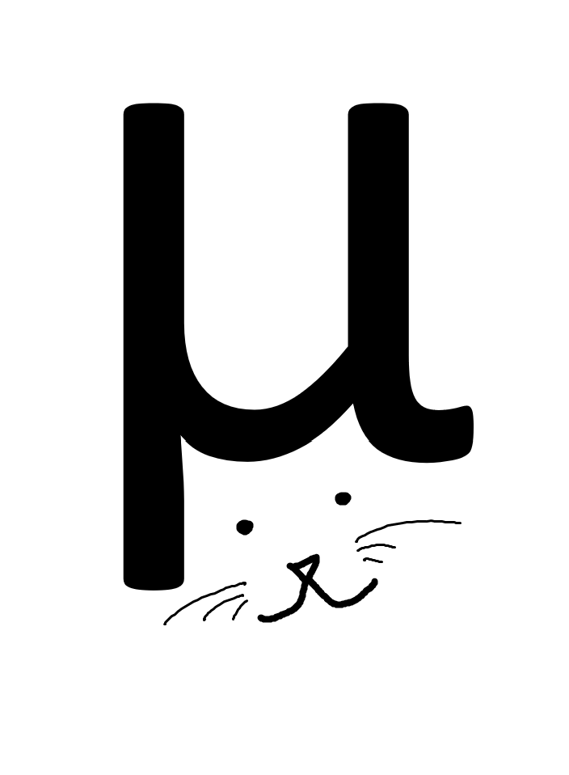

.. _home:

Welcome!
========

Summary
-------

**actuarial-model** is a pure-Python object-oriented actuarial modeling framework.

To demonstrate how it works, it includes several annuity products:

- Fixed Annuity (*FA*)
- Variable Annuity (*VA*)
- Fixed Indexed Annuity (*FIA*)

And riders:

- Guaranteed Minimum Withdrawal Benefit (*GMWB*)
- Guaranteed Minimum Death Benefit (*GMDB*)

Arranged in a basic economic liability projection.

First Steps
-----------

**It's dangerous to go alone.** Take this :ref:`tutorial <tutorial_pt1>` (and kitten) with you.

.. image:: images/kitten.png
    :width: 600

"`Micro Center <https://www.microcenter.com/>`_"*, age 2 weeks*

.. toctree::
    :hidden:
    :maxdepth: 2

    Tutorial, Part 1 <tutorial_pt1.rst>
    Tutorial, Part 2 <tutorial_pt2.rst>
    Tutorial, Part 3 <tutorial_pt3.rst>
    Model Documentation <model_doc.rst>
    System Documentation <system_doc.rst>
    About Me <about_me.rst>
